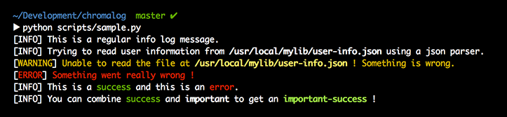

# Chromalog

**Chromalog** is a Python library that eases the use of colors in Python logging.

It integrates seamlessly into any Python 2 or Python 3 project. Based on colorama, it works on both Windows and *NIX platforms.

**Chromalog** can detect whether the associated output stream is color-capable and even has a fallback mechanism: if color is not supported, your log will look no worse than it was before you colorized it.

Using **Chromalog**, getting a logging-system that looks like this is a breeze:

Its use is simple and straightforward:

    from chromalog.mark.helpers.simple import important

    logger.info("Connected as %s for 2 hours.", important(username))

Ready to add some colors in your life ? Check out [Chromalog’s documentation](http://chromalog.readthedocs.org/en/latest/index.html) !
