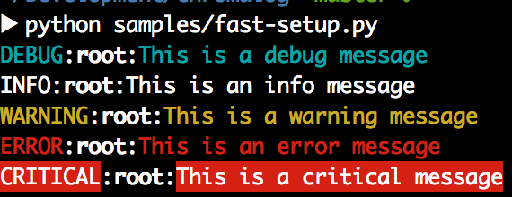
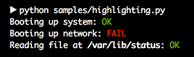
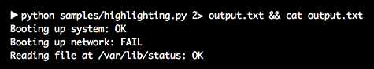

.. _quickstart:

Quickstart
==========

If you haven't installed **Chromalog** yet, it is highly recommended that
:ref:`you do so <installation>` before reading any further.

How it works
------------

**Chromalog** provides colored logging through the use of custom
:py:class:`StreamHandler <chromalog.log.ColorizingStreamHandler>` and
:py:class:`Formatter <chromalog.log.ColorizingFormatter>`.

The :py:class:`ColorizingStreamHandler <chromalog.log.ColorizingStreamHandler>`
is responsible for writing the log entries to the output stream. It can detect
whether the associated stream has color capabilities and eventually fallback to
a non-colored output mechanism. In this case it behaves exactly like a standard
:py:class:`logging.StreamHandler`. It is associated to a :ref:`color map
<color_map>` that is passed to every formatter that requests it.

The :py:class:`ColorizingFormatter <chromalog.log.ColorizingFormatter>` is
responsible for adding the color-specific markup in the formatted string. If
used with a non colorizing stream handler, the :py:class:`ColorizingFormatter
<chromalog.log.ColorizingFormatter>` will transparently fallback to a
non-colorizing behavior.

Fast setup
----------

**Chromalog** provides a :py:func:`basicConfig <chromalog.basicConfig>`
function, very similar to :py:func:`logging.basicConfig` that quickly sets up
the root logger, but using a :py:class:`ColorizingStreamHandler
<chromalog.log.ColorizingStreamHandler>` and a :py:class:`ColorizingFormatter
<chromalog.log.ColorizingFormatter>` instead.

It can be used like so to setup logging in a Python project:

.. literalinclude:: ../../samples/fast-setup.py
   :language: python
   :linenos:

Which produces the following output:

It's as simple as it gets !

Marking log objects
-------------------

While **Chromalog** has the ability to color entire log lines, it can also mark
some specific log elements to highlight them in the output.

A good example of that could be:

.. literalinclude:: ../../samples/highlighting.py
   :language: python
   :linenos:

Which produces the following output:

Note what happens when we redirect the output to a file:

As you can see, **Chromalog** automatically detected that the output stream
wasn't color-capable and disabled automatically the colorizing. Awesome !

Checkout :ref:`marking_functions` for the complete list of available marking
functions.

What's next ?
-------------

Want to learn more about **Chromalog** ? Go read :ref:`advanced` !

.. toctree::
   :maxdepth: 2
